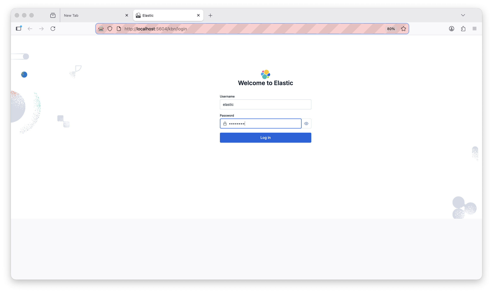

# kibana-puppeteer-scripts


## Prerequisites

- Node.js
- A running instance of Kibana
- Firefox (used by Puppeteer in non-headless mode)

## Setup

```bash
npm install
npx puppeteer browsers install firefox
```

NOTE: This uses firefox to skip the "known password" warning in chrome. There is a setting but no way to persist it between sessions.

## `install-prebuilt-rules`

A Puppeteer automation script that installs all prebuilt Elastic Security detection rules via the Kibana UI.

Please make sure that you have a clean instance of es + kibana running at `http://localhost:5604`


### What it does

Automates the following steps in Firefox:

1. Navigates to a local Kibana instance at `http://localhost:5604`
2. Logs in with default credentials
3. Navigates to **Security → Rules → Detection rules**
4. Clicks **Add Elastic rules** to open the prebuilt rules catalog
5. Clicks **Install all** to install every available prebuilt rule
6. Waits for installation to complete and returns to the rules list




## Usage

```bash
npm run install-prebuilt-rules
```

The script runs with `headless: false` so you can watch it execute in a browser window. Total runtime is roughly 3–4 minutes due to the built-in delays waiting for Kibana to load and the rule installation to complete.

## Configuration

Edit [install-prebuilt-rules.js](install-prebuilt-rules.js) to change:

- **Kibana URL** — update the `goto` call (default: `http://localhost:5604/kbn/login`)
- **Credentials** — update the `fill` calls (default: `elastic` / `changeme`)
- **Browser** — change `browser: 'firefox'` to `'chrome'` if preferred